# Geography Quiz
(Developer: Ulrike Riemenschneider)

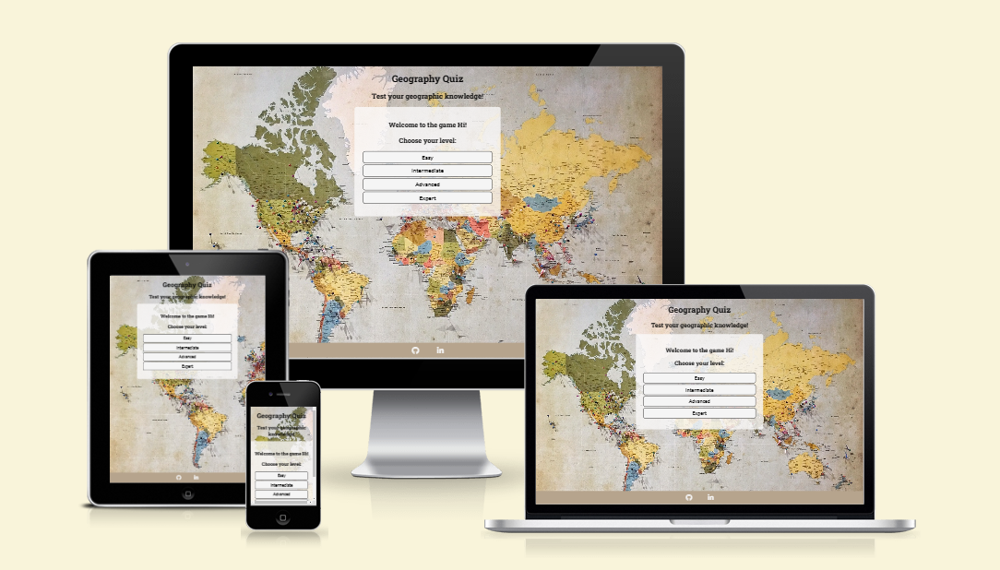

[Live webpage](https://uriem.github.io/geography-game/)

## Table of Content

1. [Introduction](#introduction)
2. [Project Goals](#project-goals)
    1. [User Goals](#user-goals)
    2. [Site Owner Goals](#site-owner-goals)
3. [User Experience](#user-experience)
    1. [Strategy](#strategy)
        * [Target Audience](#target-audience)
        * [User Requirements & Expectations](#user-requirements-and-expectations)
        * [User Stories](#user-stories)
    2. [Scope](#scope)
        * [Initial Stage](#intial-stage)
        * [Future Additions](#future-additions)
    3. [Structure](#structure)
        * [Wireframes](#wireframes)
    4. [Skeleton](#skeleton)
        * [Welcome](#welcome-section)
        * [Choose A Level](#choose-a-level-section)
        * [Quiz Section](#quiz-section)
        * [End of Game](#end-of-game-page)
        * [Footer](#footer)
        * [Future Additions](#future-additions)
    5. [Surface](#surface)
        * [Color Scheme](#color-scheme)
        * [Font](#font)
4. [Technologies Used](#technologies-used)
    1. [Language](#languages)
    2. [Frameworks & Tools](#frameworks--tools)
    3. [Helpful Sites](#helpful-sites)
5. [Testing and Validation](#testing-and-validation)
    1. [HTML](#html-validation)
    2. [CSS](#css-validation)
    3. [JavaScript](#javascript-validation)
    4. [Accessibility & Performance](#accessibility--performance)
    5. [Browser Compatability](#browser-compatability)
    6. [Testing User Stories](#testing-user-stories)
6. [Bugs & Fixes](#bugs--fixes)
7. [Deployment & Development](#deployment--development)
8. [Credits](#credits)

## Introduction

The Geography Quiz is a multiple choice online quiz testing the users knowledge on the capital cities of the world. The user can choose between several levels of difficulty when playing the game. The user gets feedback on the number of questions in the ongoing quiz and the score.

## Project Goals

### User Goals
- The site's user wants to play an online quiz to test their geographic knowledge about capital cities of the world.

### Site Owner Goals
- The site owner's goal is to provided an entertaining and appropriately challenging quiz to the online user.

## User Experience

### Strategy

#### Target Audience
- Users with an interest in geography.
- Users looking for entertaining content online.

#### User Requirements and Expectations
- Simple and intuitive navigation system.
- Links work as expected.
- Immediate feedback on progress.
- Visually appealing responsive design.
- Accessibility.

#### User Stories

##### First-time User
As a first time user, I want to ...
1. ... easily navigate though the quiz.
2. ... get clear feedback on my score.
3. ... easily return to the beginning of the game and play again.

##### Returning Users
As a returning user, I want to ...
1. ... try a higher-level game.
2. ... see my previous scores.
3. ... find out more about the game developer.

##### Site owner
As the site owner, I want users to ...
1. ... interact with the game, stay engaged and enjoy the challenge.
2. ... return to the game in the future.

### Scope

#### Intial Stage

At the initial stage the site will include a welcome section that displays the rules of the game and lets the user input a username, then the user is given a choice of four levels of difficulty of the game. Finally the game will start and run though 10 questions at the chosen level. An end of game page will then load, here the user can opt to play the game again.

#### Future Additions

At the present stage of development the user gets only basic feedback on their progess in the form of a score tally below the question displayed. In future more feedback could be implemented, such as a delay in the loading of the next question, during this delay the chosen answer color background would change to indicate whether the answer was wrong (red background) or correct (green background). 

In addition, it would enhance the experience of the user to be able to save scores and keep track of progress. This could be acchieved by adding a 'save score' option on the final page.
 

### Structure

#### Wireframes

The structure of the initial site will include three section incorporated in the index.html page:

1. **Welcome Section** displays the rules of the game and asks the user to input a username in order to proceed to playing the game.

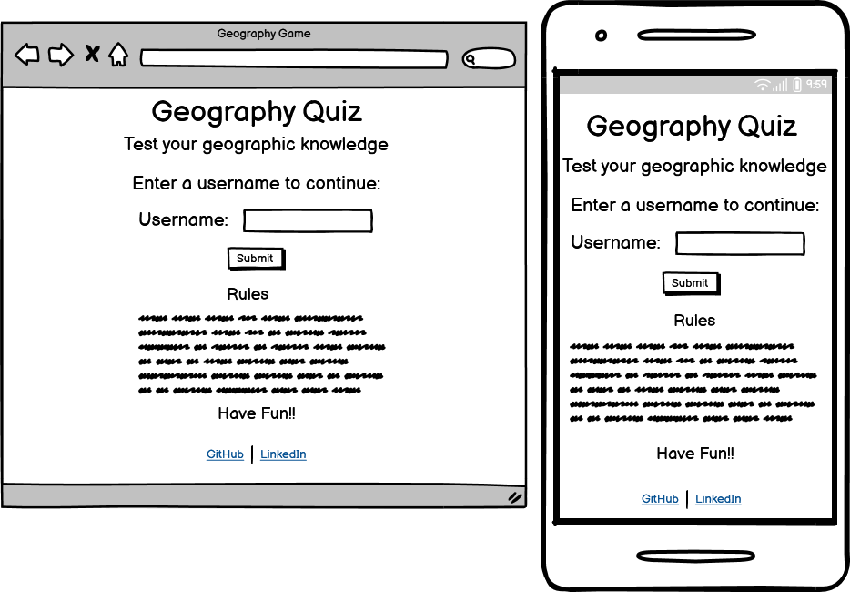

4. **Choose Level Section** with four difficulty levels of the game to choose from.

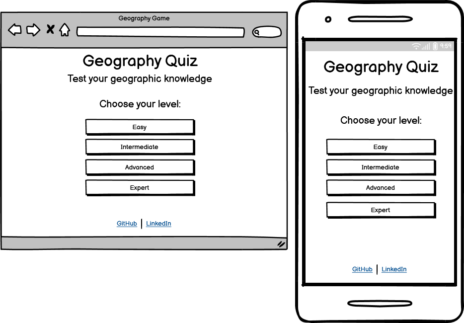

2. **Quiz Section** which runs through ten questions at the users chosen level of difficulty. It keeps track of the score in a score area below the answers.

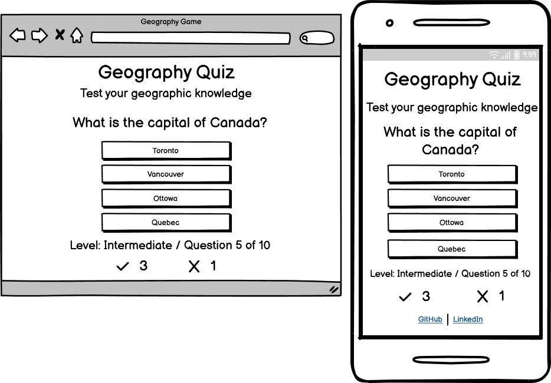

3. **End of Game Page** which displays the users final score and level at which the game was played with a matching message. It gives and option to play the game again. This will be in a separate end_game.html file.

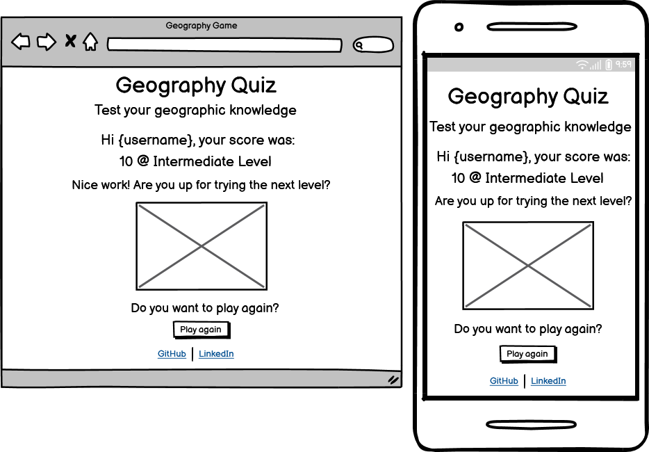

5. **404 Page** - a simple 404 Error page is also included (404.html)

### Skeleton

As described in the previous section with the aid of wireframes, the online game site includes four interactive sections, which all have a heading, a central display area and a footer. The welcome section requires the user to input a username to continue to the game. The user is then prompted to choose the level at which they would like to play the game, upon choosing a level the game loads and runs, adding to the score of correct or wrong answers as the answers are chosen. At the end of the game a page displaying the final score is displayed.

#### Welcome Section

Screenshot of Welcome Section

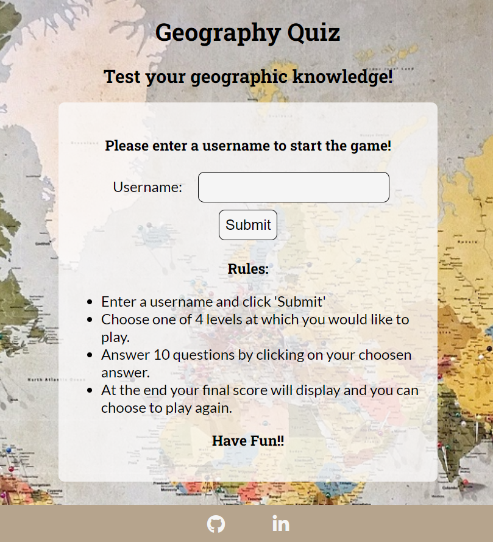

- Features an input field. The user is required to enter a username to continue. A submit button initiates the next section if a username has been entered. The rules of the game are also diplayed.

#### Choose A Level Section

Screenshot of the Choose a Level Section

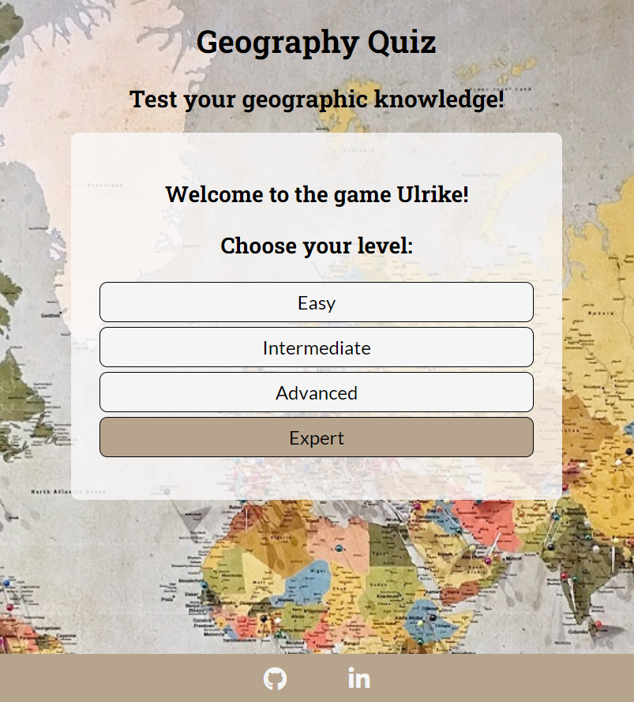

- Features four clickable elements containing the choices of levels the user can opt for: Easy, Intermediate, Advanced, and Expert.

#### Quiz Section

Screenshot of Quiz Section

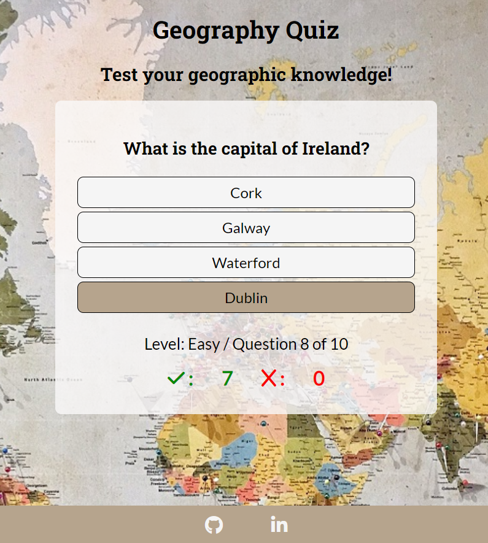

- Features the question displayed at the top of the central content area.
- Four clickable text elements contain the multiple choice answers.
- A score area below the answers updates the correct and wrong answer tally every time the user chooses an answer. It also keeps track of the current and total number of questions.

#### End of Game page

Screenshot of End of Game 

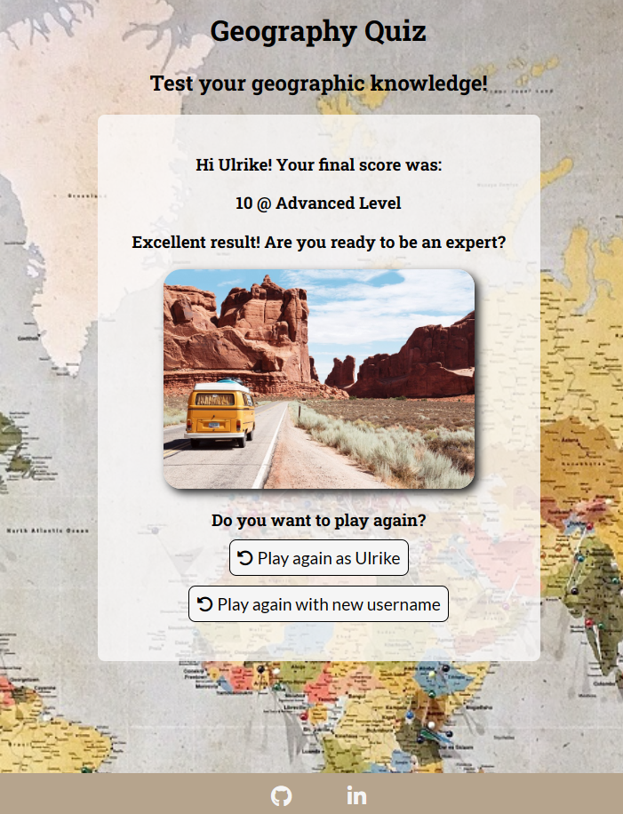

- Features the score and level at which the game was played.
- A message is posted on the page, depending on the score and level of play.
- An image in the center of the page makes the display more eye catching and appealing.
- Below the image two clickable elements allow the user to play again either with the same username or by entering a new username.

#### Footer

Screenshot of Footer

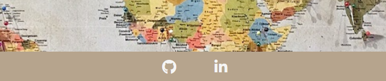

- Featured on all pages (and the 404 page).
- Includes links to the LinkedIn and GitHub page of the developer.
- All links open in a new window.

#### Future Additions

To enhance the UX the user could be given an option on the final page to save their scores. Another page or section could then appear that would display past scores of the user.

### Surface

The surface design of the website is aimed to convey an adventurous and global feel, while remaining uncluttered, and maintaining easy of readability. The background image of a world map was choosen with this aim in mind and the color scheme was choosen to match the image.

#### Color Scheme

The color scheme is a balance of earthy colors that match the color scheme of the background image. On a desktop buttons and text elements change to colors from this palett when the user hovers over them. The footer background also matches the color scheme. The remaining features on the site and font are a balance of a dark grey or black, as well as white or off white in order to maintain contrast and readability.

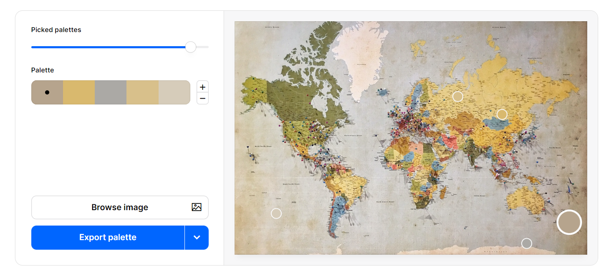

#### Font

Roboto Slab is the font used for high level headings in the game, the clickable text of level choices and answers as well as the score counter ar in a matching Lato font. 

## Technologies Used

### Languages
- HTML
- CSS
- JavaScript

### Frameworks & Tools
- Git
- GitHub
- Gitpod
- Balsamiq
- Google Fonts
- Font Awesome
- Coolors.co

### Helpful sites

Several sites came in handy while developing the code to help with problem solving:

- <a href="https://www.w3schools.com/">W3 Schools</a>
- <a href="https://stackoverflow.com">Stack Overflow</a>
- <a href="https://developer.mozilla.org/">mdn web docs</a>

## Testing and Validation

### HTML Validation

The W3C Markup Validation Service was used to validate the HTML of the website. All pages passed with no errors. Warnings regarding empty headings can be ignored as the text content for the headings is provided by JavaScript as the game progesses.

Welcome and Quiz Page

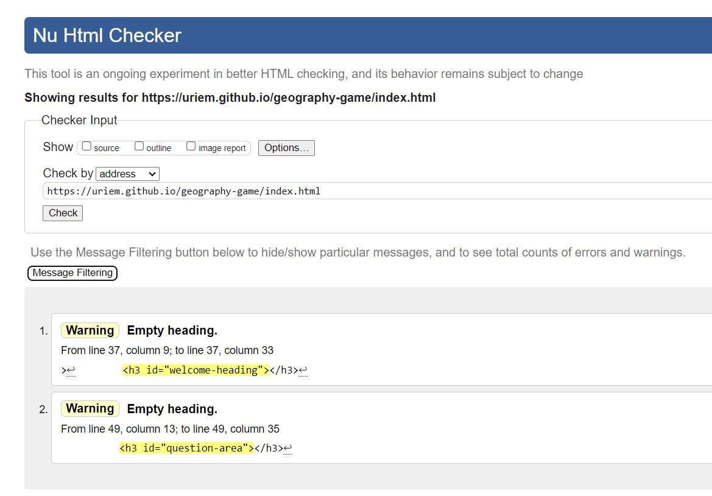

End of Game Page

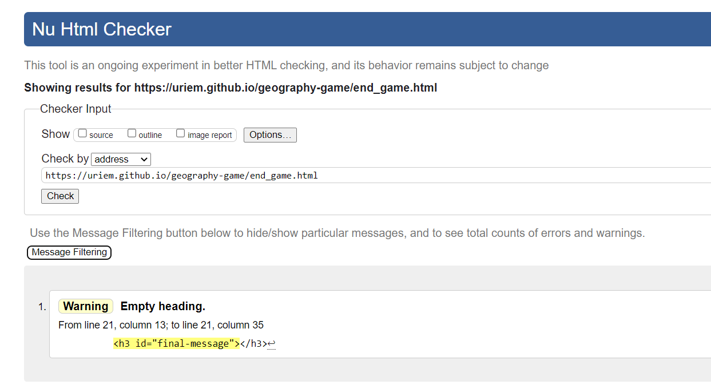

### CSS Validation

The W3C Jigsaw CSS Validation Service was used to validate the CSS of the website. The code passed with no errors or warnings.

CSS Validation Screenshot

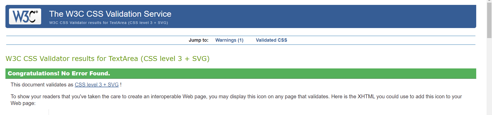

### JavaScript Validation

The linter <a href="https://jshint.com/">JSHint</a> was used to validate the JavaScript files. Small issues, such as missing semicolons, etc. were fixed. Unused variable warnings were ignored, as those variables or functions where called/used in either the html files or other JS files.

### Accessibility & Performance

The Lighthouse feature on Google Devtools was used to assess accessibility and performance. All pages score high on accessibility.

Welcome and Quiz Page

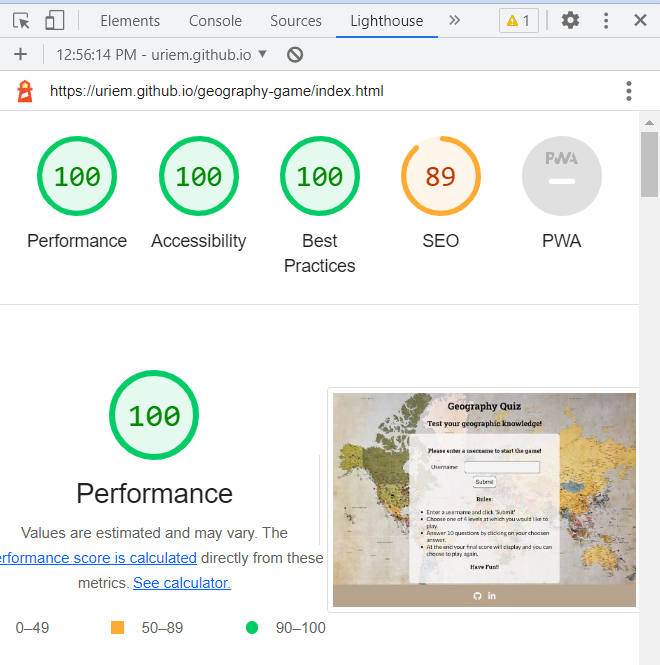

End of Game Page

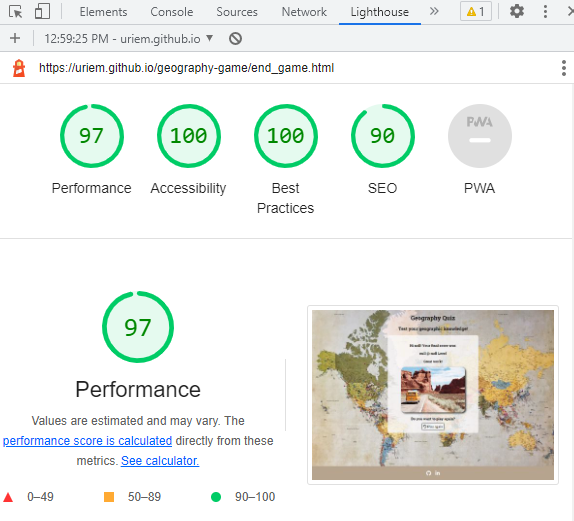

#### Outstanding Issues

There are currently no outstanding issues that the developer is aware of.

### Browser Compatability

The websites compatability was tested on the following browsers:

* Google Chrome
* Mozilla Waterfox
* Microsoft Edge
* Safari

### Testing User Stories

1. As a first time user, I want to easily navigate though the quiz.

| **Feature** | **Action** | **Expected Result** | **Actual Result** |
|-------------|------------|---------------------|-------------------|
| Welcome Section | Input a username and submit | The choose a level section displays | Works as expected |
| Choose A Level Section | Click on the choosen level | The game starts | Works as expected |
| Quiz Section | Click through the answers | New questions are continuously displayed | Works as expected |
| End of Game Page | Choose to play again | Welcome page displays | Works as expected |

2. As a first time user, I want to get clear feedback on my score.

| **Feature** | **Action** | **Expected Result** | **Actual Result** |
|-------------|------------|---------------------|-------------------|
| Quiz page | Click quiz answers | Wrong and correct answer scores are updated and displayed below the answers | Works as expected |

3. As a first time user, I want to easily return to the beginning of the game and play again.

| **Feature** | **Action** | **Expected Result** | **Actual Result** |
|-------------|------------|---------------------|-------------------|
| End of Game page | Click on one of the Play Again button | Links back to the welcome section and the game starts over | Works as expected |

4. As a returning user, I want to try a higher-level game.

| **Feature** | **Action** | **Expected Result** | **Actual Result** |
|-------------|------------|---------------------|-------------------|
| Choose A Level | Choose level of game at which to play | Game will play at chosen level | Works as expected |

5. As a returning user, find out more about the game developer.

| **Feature** | **Action** | **Expected Result** | **Actual Result** |
|-------------|------------|---------------------|-------------------|
| Footer-social media links  | On any page scroll down to the footer | Find social media links | Works as expected | 

6. As the site owner, I want users to interact with the game, stay engaged and enjoy the challenge.

| **Feature** | **Action** | **Expected Result** | **Actual Result** |
|-------------|------------|---------------------|-------------------|
| Welcome Section | Input a username and submit | The choose a level section displays | Works as expected |
| Choose A Level Section | Click on the choosen level | The game starts | Works as expected |
| Quiz Section | Click through the answers | New questions are continuously displayed | Works as expected |
| End of Game Page | Choose to play again | Welcome page displays | Works as expected |

#### Room for improvement on User Stories

A feature that allows a returning user to save their score is still missing and could be implemented in the future to enhance the experience of users.

## Bugs & Fixes

| **Bug** | **Fix** |
| ----------- | ----------- |
| Username variable did not save/update correctly in Local Storage. In the html the username entered in the previous round of play displayed, as opposed to the new username entered in the current round of play. | The username was assigned to Local Storage inside the validation function as opposed to returned from the function and then assiged to Local Storage outside the function. This fixed the problem. |
| On mobile displays the hover function for clickable elements led to glitches, which meant that clickable text would appear with highlighted background at inappropriate times. | Hover function was disabled on displays below a certain screen width. |

## Deployment & Development

The website was deployed using GitHub Pages by following these steps:

1. In the GitHub respository navigate to the Settings tab.
2. Select Pages from the menu on the left-hand side of the page.
3. For the source select Branch: 'main' and then select: 'save'.
4. After the webpage refreshes automatically a ribbon at the top will displays the following message: "Your site is live at https://uriem.github.io/geography-game/"

The website repository can be forked by the following steps:

1. Go to the GitHub repository.
2. Click on the Fork button in the upper right hand corner.

The repository can be cloned by the following steps:

1. Got to the GitHub repository.
2. Locade the Code button above the list of files and click on it.
3. Select if you prefer to clone using HTTPS, SSH, or Github CLI and click the copy button to copy the URL to your clipboard.
4. Open Git Bash.
5. Change the current working directory to the one where you want the cloned directory.
6. Type git clone and paste the URL from the clipboard ($ git clone https://github.com/YOUR-USERNAME/YOUR-REPOSITORY)
7. Press Enter to create your local clone.

## Credits

### Media

Images not referenced below are owned by the developer.

Images:
* Background image by <a href="https://unsplash.com/@drwmrk">Andrew Stutesman</a> on <a href="https://unsplash.com/photos/l68Z6eF2peA">Unsplash</a>
* End of Game page image by <a href="https://unsplash.com/@dinoreichmuth">Dino Reichmuth</a>  on <a href="https://unsplash.com/photos/A5rCN8626Ck">Unsplash</a>
* 404 page image by <a href="https://unsplash.com/@fransaraco">Francesa Saraco</a>  on <a href="https://unsplash.com/photos/VKPAzDovWKU">Unsplash</a>

### Code

Resources and inspiration came from a few sources:

- Movie Quotes Quiz by Jose Maciel https://zemaciel.github.io/project-02/index.html - this was where I got the idea for my quiz. I enjoyed much of the functionality and features of his game and took inspriration from it as I was developing my own.
- Code by Marek https://www.codehim.com/vanilla-javascript/javascript-multiple-choice-questions-code/ helped me to set up the core functionality of the quiz.
- The following link gave me ideas how to validate user input https://www.freecodecamp.org/news/form-validation-with-html5-and-javascript/
- The functionality for keeping track of the score was inspired by the Love Maths project.

### Acknowledgements

I would like to thank:
- My mentor Brian O'Hare for his feedback, advice, guidance and support.
- Cohort fascilitator Paul Thomas O'Rirodan, for his general advice on the management of the course and pointing us to a plethora of resources to help with the projects.
- My husband, Matt, for his encouragement and support along the way.