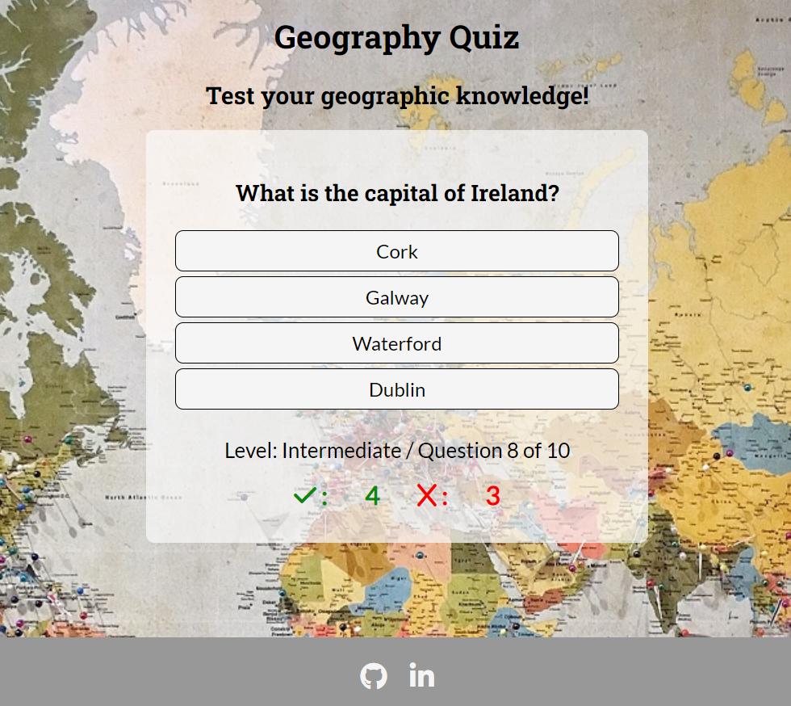

# Creative Spaces
(Developer: Ulrike Riemenschneider)

[Live webpage](https://uriem.github.io/geography-game/)

## Table of Content

1. [Introduction](#introduction)
2. [Project Goals](#project-goals)
    1. [User Goals](#user-goals)
    2. [Site Owner Goals](#site-owner-goals)
3. [User Experience](#user-experience)
    1. [Strategy](#strategy)
        * [Target Audience](#target-audience)
        * [User Requirements & Expectations](#user-requirements-and-expectations)
        * [User Stories](#user-stories)
    2. [Scope](#scope)
        * [Initial Stage](#intial-stage)
        * [Future Additions](#future-additions)
    3. [Structure](#structure)
        * [Wireframes](#wireframes)
    4. [Skeleton](#skeleton)
        * [Header](#header)
        * [Footer](#footer)
        * [Services offered](#services-offered)
        * [Calls to action](#call-to-action)
        * [About page](#about-page)
        * [Contact page](#contact-page)
        * [Gallery and Images](#gallery-page-and-images)
        * [Future Additions](#future-additions)
    5. [Surface](#surface)
        * [Color Scheme](#color-scheme)
        * [Font](#font)
4. [Technologies Used](#technologies-used)
    1. [Language](#languages)
    2. [Frameworks & Tools](#frameworks--tools)
5. [Testing and Validation](#testing-and-validation)
    1. [HTML](#html-validation)
    2. [CSS](#css-validation)
    3. [Accessibility & Performance](#accessibility--performance)
    4. [Browser Compatability](#browser-compatability)
    5. [Testing User Stories](#testing-user-stories)
6. [Bugs & Fixes](#bugs--fixes)
7. [Deployment & Development](#deployment--development)
8. [Credits](#credits)

## Introduction

The Geography Game is a multiple choice online quiz testing the users knowledge on the capital cities of the world.

## Project Goals

### User Goals
- The site's user wants to play an online quiz to test their geographic knowledge about capital cities of the world.

### Site Owner Goals
- The site owner's goal is to provided an entertaining and appropriately challenging quiz to the online user.

## User Experience

### Strategy

#### Target Audience
- Users with an interest in geography.
- Users looking for entertaining content online.

#### User Requirements and Expectations
- Simple and intuitive navigation system.
- Links work as expected.
- Immediate feedback on progress.
- Visually appealing responsive design.
- Accessibility.

#### User Stories

##### First-time User
As a first time user, I want to ...
1. ... easily navigate thought the quiz.
2. ... get clear feedback on my score.

##### Returning Users
As a returning user, I want to ...
1. ... try a higher-level game.
2. ... see my previous scores.

##### Site owner
As the site owner, I want users to ...
1. ... interact with the game, stay engaged and enjoy the challenge.
2. ... return to the game in the future.

### Scope

#### Intial Stage

At the initial stage the site will include a welcome page that gives the user a choice of four levels of difficulty of the game. Then the game will start and run though 10 questions at the chosen level. A final end of game page will then be shown where the user can opt to save the results and play the game again.

#### Future Additions

 

### Structure

#### Wireframes

The structure of the initial site will include three pages:

1. **Welcome Page** with four difficulty levels of the game to choose from.

2. **Game Page** which runs through ten questions at the users chosen level of difficulty. It keeps track of the score in a score area below the answers.

3. **End of Game Page** which displays the users final score and level at which the game was played with a matching message. It gives and option to play the game again or enter a username and save the score and level of play.

4. **Score Tally Page** displays the users past game scores including the level at which the game was played.

5. **404 Page** - a simple 404 Error page is also included.

### Skeleton

As described in the previous section with the aid of wireframes, the online game site includes four pages, which all have a heading, a central display area and a footer. The welcome page allows the user to choose the level at which they would like to play the game, upon choosing a level the game loads and runs, adding to the score of correct or wrong answers as the answers are chosen. At the end of the game a page displaying the final score is displayed.

#### Welcome page

Screenshot of Welcome page

- Features four clickable elements containing the choices of levels the user can opt for: Easy, Intermediate, Advanced, and Expert.

#### Quiz page

Screenshot of Quiz page

- Features the question displayed at the top of the central content area.
- Four clickable text elements contain the multiple choice answers.
- A score area below the answers updates the correct and wrong answer tally every time the user chooses and answer.

#### End of Game page

Screenshot of End of Game 

- Features the score and level at which the game was played.
- An image in the center of the page makes the display more eye catching and appealing.
- Below the image a button allows the user to return to the welcome page and play again.

#### Footer

Screenshot of Footer

- Featured on all pages (and the 404 page).
- Includes links to the LinkedIn and GitHub page of the developer.
- All links open in a new window.

#### Future Additions

### Surface

The surface design of the website is aimed to convey an adventurous and global feel, while remaining uncluttered, and maintaining easy of readability. The backgroundimage of a world map was choosen with this aim in mind and the color schemes was choosen to match the image.

#### Color Scheme

The color scheme is a balance of vibrant colors that draw attention and convey artistic energy. A vibrant purple color was chosen in conjunction with the hero image and a desire for them to blend together. It was used to frame all important information on the site and all clickable buttons are styled with this color. The remaining features on the site and font are a balance of a dark grey or black, as well as white or off white in order to maintain contrast and readability.

#### Font

Roboto Slab is the font used for high level headings in the game, the clickable text of level choices and answers as well as the score counter ar in a matching Lato font. 

## Technologies Used

### Languages
- HTML
- CSS
- JavaScript

### Frameworks & Tools
- Git
- GitHub
- Gitpod
- Balsamiq
- Google Fonts
- Font Awesome
- Coolors.co

### Helpful sites

Several sites came in handy while developing the code to help with problem solving:

- W3 Schools
- stackoverflow.com
- mdn web docs (https://developer.mozilla.org/)

## Testing and Validation

### HTML Validation

The W3C Markup Validation Service was used to validate the HTML of the website. All pages passed with no errors or warnings.

Welcome and Quiz Page

End of Game Page

### CSS Validation

The W3C Jigsaw CSS Validation Service was used to validate the CSS of the website. The code passed with no errors or warnings.

CSS Validation Screenshot

### JavaScript Validation

The JSHint (https://jshint.com/) was used to validate the JavaScript files.

### Accessibility & Performance

The Lighthouse feature on Google Devtools was used to assess accessibility and performance. All pages score high on accessibility. The gallery page scores lowest on performance due to the large number of images.

Welcome and Quiz Page

End of Game Page

#### Outstanding Issues

### Browser Compatability

The websites compatability was tested on the following browsers:

* Google Chrome
* Mozilla Waterfox
* Microsoft Edge
* Safari

### Testing User Stories

1. As a first time user, I want to know what services are offered at Creative Spaces.

| **Feature** | **Action** | **Expected Result** | **Actual Result** |
|-------------|------------|---------------------|-------------------|
| Home page | Navigate to the type of art activities you are interested in | Locating information on activities offered | Works as expected |

2. As a first time user, I want to know times, location, and types of classes offered.

| **Feature** | **Action** | **Expected Result** | **Actual Result** |
|-------------|------------|---------------------|-------------------|
| Home page | Navigate to the type of art activities you are interested in | See classes and times offered | Works as expected |
| Footer - address | Scroll down to the footer of the page | Find the address of the school | Works as expected |

3. As a first time user, I want to know how to get in contact with the business and request more information.

| **Feature** | **Action** | **Expected Result** | **Actual Result** |
|-------------|------------|---------------------|-------------------|
| Contact page | Navigate to the contact page and locate the form | Find and fill out contact form | Works as expected |
| Footer-social media links  | On any page scroll down to the footer | Contact via any social media platform | Works as expected | 

4. As a first time user, I want to find more information about the staff mentoring and supervising the children.

| **Feature** | **Action** | **Expected Result** | **Actual Result** |
|-------------|------------|---------------------|-------------------|
| About page | Navigate to the about page | Find information on the staff and their classes | Works as expected |

5. As a first time user, I want to get a feel for what to expect from the classes and fascilities.

| **Feature** | **Action** | **Expected Result** | **Actual Result** |
|-------------|------------|---------------------|-------------------|
| About page | Navigate to the about page | Find information on the staff and their classes | Works as expected |
| Gallery page | Navigate to the gallery page | Find samples of work produced by teachers and students | Works as expected |

6. As a returning user, I want to see the times and types of classes offered.

| **Feature** | **Action** | **Expected Result** | **Actual Result** |
|-------------|------------|---------------------|-------------------|
| Home page | Navigate to the type of art activities you are interested in | Locating information on activities offered | Works as expected |

7. As a returning user, I want to see if there is any new classes offered.

| **Feature** | **Action** | **Expected Result** | **Actual Result** |
|-------------|------------|---------------------|-------------------|
| Contact page | Navigate to the contact page and locate the form | Find and fill out contact form for more information | Works as expected |
| Footer-social media links  | On any page scroll down to the footer | See if new classes are advertised on social media | Works as expected | 

8. As a returning user, I want to find social media links to connect with the business.

| **Feature** | **Action** | **Expected Result** | **Actual Result** |
|-------------|------------|---------------------|-------------------|
| Footer-social media links  | On any page scroll down to the footer | Find social media links | Works as expected | 

9. As a returning user, I want to find directions to the location of the business.

| **Feature** | **Action** | **Expected Result** | **Actual Result** |
|-------------|------------|---------------------|-------------------|
| Footer - address  | On any page scroll down to the footer | Find address of the school | Works as expected | 

10. As the site owner, I want users to interact with the space, learn about the space, learn about the services offered, learn about the benefits of the service, and sign up for more information.

| **Feature** | **Action** | **Expected Result** | **Actual Result** |
|-------------|------------|---------------------|-------------------|
| Home page | Navigate to the type of art activities and philosophy section | Find information on activities offered and business motivation | Works as expected |
| Footer-social media links  | On any page scroll down to the footer | Contact via any social media platform | Works as expected | 
| Contact page | Navigate to the contact page and locate the form | Find and fill out contact form | Works as expected |
| About page | Navigate to the about page and read about staff backgrounds and classes they offer | Read the page | Works as expected |

11. As the site owner, I want users to feel comfortable and at ease reaching out for more information.

| **Feature** | **Action** | **Expected Result** | **Actual Result** |
|-------------|------------|---------------------|-------------------|
| Footer-social media links  | On any page scroll down to the footer | Contact via any social media platform | Works as expected | 
| Contact page | Navigate to the contact page and locate the form | Find and fill out contact form | Works as expected |

#### Room for improvement on User Stories

While all the minimum criteria for fullfilling the user stories are met, there are several items that could be improved upon:

1. A map could be included at the bottom of the home page to give more explicit directions to the location. This would strengthen user story number 9.

2. A  more explicit section or link could be provided on new services, news, or special events. This would stengthen user story number 7.

3. More information about the fascilities could be included, in the form of text about or images of the building, rooms, art supplies and materials provided at the space. This would strengthen user story number 5. 

## Bugs & Fixes

| **Bug** | **Fix** |
| ----------- | ----------- |
| Images framed in the philosophy section failed to be responsive at very small screen sizes. | Max-width of image was set to 90% and margins to % values also for more responsiveness |
| Header styling failed on small screen sizes | Font size of logo and menu was decreased and menu floated left to fit header on two lines |
| Spurious tiny underscore lines appeared between the social media links when using 'display: inline' for the CSS styling of the .social-networks class. | Using 'display: flex' eliminated the lines. | 

## Deployment & Development

The website was deployed using GitHub Pages by following these steps:

1. In the GitHub respository navigate to the Settings tab.
2. Select Pages from the menu on the left-hand side of the page.
3. For the source select Branch: 'main' and then select: 'save'.
4. After the webpage refreshes automatically a ribbon at the top will displays the following message: "Your site is live at https://uriem.github.io/art-school/"

The website repository can be forked by the following steps:

1. Go to the GitHub repository.
2. Click on the Fork button in the upper right hand corner.

The repository can be cloned by the following steps:

1. Got to the GitHub repository.
2. Locade the Code button above the list of files and click on it.
3. Select if you prefer to clone using HTTPS, SSH, or Github CLI and click the copy button to copy the URL to your clipboard.
4. Open Git Bash.
5. Change the current working directory to the one where you want the cloned directory.
6. Type git clone and paste the URL from the clipboard ($ git clone https://github.com/YOUR-USERNAME/YOUR-REPOSITORY)
7. Press Enter to create your local clone.

## Credits

### Media

Images not referenced below are owned by the developer.

Images:
* Hero image by <a href="https://unsplash.com/@dragos126">Dragos Gontariu</a> on <a href="https://unsplash.com/photos/54VAb3f1z6w">Unsplash</a>
* 

### Code

Resources:

- Movie Quotes Quiz by Jose Maciel https://zemaciel.github.io/project-02/index.html
- Mike Dane on YouTube https://www.youtube.com/watch?v=LQGTb112N_c
- Code by Marek https://www.codehim.com/vanilla-javascript/javascript-multiple-choice-questions-code/
https://developer.mozilla.org/en-US/docs/Web/API/Window/load_event

### Acknowledgements

I would like to thank:
- My mentor Brian O'Hare for his feedback, advice, guidance and support.
- Cohort fascilitator Paul Thomas O'Rirodan, for his general advice on the management of the course and pointing us to a plethora of resources to help with the projects.
- My husband, Matt, for his encouragement and support along the way.